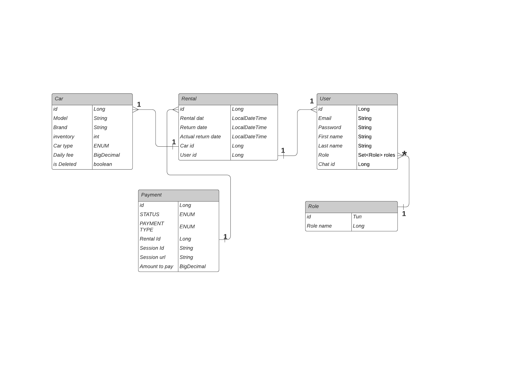

# Car-sharing-service

### Description

>Car-Sharing-Service is a RESTful web application designed to solve car rental tasks.
> The application is built on Spring Boot and utilizes Java, adhering to the principles of the
> REST architectural style, ensuring stateless communication between clients and the server.
> Users can easily register and log in using their credentials. The application offers role-based
> authorization for administrators and regular users. A unique feature of service is the integration
> with the Stripe payment system, which guarantees secure and reliable transactions for users.
> This allows you to pay for car rentals with maximum comfort. Also, app have a notification feature
> through a Telegram bot, allowing users to quickly receive crucial information about the rental status,
> payments, and any changes in the condition of the cars. Car-Sharing-Service is a modern tool for car
> rental that offers speed, security, and convenience to all its users.

### :mag: Features
- register and log in as a customer/manager;

#### Registered as CUSTOMER role:
- find all cars and see their characteristics
- find all cars with sorting and pagination
- find car by id
- create payments
- get owm payments
- create rental
- get own rentals
- get own info
- update own info
#### Registered as MANAGER role:
- create car
- update car
- add car to inventory
- remove car from inventory
- delete car
- find car by id
- find all cars and see their characteristics
- find all cars with sorting and pagination
- create payments
- find payments by user id
- find rental by id
- find rentals by user id and status
- create rental
- return car for rental (user cannot do it because price will depend on this event)
- get own info
- update own info
- update user's role

> Two users have already existed in the database. Manager has login: bob@gmail.com, password : admin123. Customer - login: alice@gmail.com, password: custom123

#### :hammer: Technologies
- Java 17
- Spring Boot 3.1.0
- Springdoc OpenAPI (Swagger) 2.1.0
- Liquibase
- MySQL 5.7
- Lombok TBD
- Stripe Java 22.21.0
- Jjwt 0.9.1
- Telegram Bots 6.5.0
- Docker 23.0.5
- Apache Maven 3.8.7
- REST-assured
- Testcontainers

### :green_book: Project structure
> The project has a Three-Tier Architecture:

| Layer                                 | Responsibilities                                                              | 
|---------------------------------------|-------------------------------------------------------------------------------|
| **Presentation layer (Controllers)**  | Accepts requests from clients and sends results back to them.                 |
| **Application logic layer (Service)** | Provide logic to operate on the data sent to and from the DAO and the client. |
| **Data access layer (Repository)**    | Represents a bridge between the database and the application.                 |

### DB Diagram

### :memo: Technical details
* Entities represent columns in the database;
* DTOs represent communication between Presentation and Service layers;
* DTO mappers convert DTOs to entities and vice versa
* Application uses telegram bot for notify manager or user about different events
* The Stripe library can create a payment session and payment URL, which users can use for payment.
* BCryptPasswordEncoder is used for password encryption
* Hibernate annotations are used for field validation
* Custom annotations are used for email and password validation
* Jackson API is responsible for converting objects to JSON
* Config package contains classes allow to configure Spring and Hibernate
* Security package contains class, allows to create UserDetails which store user information;
* JWT make this application stateless

### Getting Started
##### To get started with the car-sharing service, follow these steps:

##### For local run
- Clone the repository from [here](https://github.com/Nikitos787/car-sharing-service.git);
- Get a token to create a Telegram bot from https://t.me/BotFather
- Get stripe secret api key from [website](https://stripe.com/)
- Set your credentials in [application.properties](src/main/resources/application.properties)
- Set your credentials for tests in [application.properties](src/test/resources/application.properties)
- Build the project: `mvn clean package`
- Press `run`

#### You can also use [Docker](https://www.docker.com/):
- Ensure that you have Docker installed and running
- Clone the repository from [here](https://github.com/Nikitos787/car-sharing-service.git);
- Set up the necessary environment variables (refer to [.env](.env) for the required variables)
- Set your credentials in [application.properties](src/main/resources/application.properties)
- Set your credentials for tests in [application.properties](src/test/resources/application.properties)
- Build the project: `mvn clean package`
- Run the command: `docker-compose up`
- You can test the application using Swagger by accessing http://localhost:8080/swagger-ui/index.html#

> Also, you can use my postman collection

- [Collection for local run](postman.collections/car-sharing-service.postman_collection.json) 
or [this link](https://www.postman.com/supply-observer-16858482/workspace/for-people/collection/27238121-3ac30850-3272-4643-adc5-cb50552da2bd?action=share&creator=27238121)
- [Collection for docker run](postman.collections/car-sharing-service%20for%20docker.postman_collection.json) 
or [this link](https://www.postman.com/supply-observer-16858482/workspace/for-people/collection/27238121-7cc8d2bb-cae7-4be3-b986-4fc7608c6366?action=share&creator=27238121)
- if you want to run tests, you should run docker before this. Also don't forget add properties in application.properties for tests [here](src/test/resources/application.properties)
> Just import it to your Postman and enjoy! Good luck!
